# Manual Hoja de trabajo 1

- ## Comandos de configuracion para switches
### configuracion del nombre de cada switch
```
Switch>enable
Switch# configure terminal
Switch(config)# hostname <nuevo_nombre>
Switch(config)# exit
write memory
```
### Switch servidor
- Configuracion VTP modo server
```
servidor# configure terminal
servidor(config)# vtp version 2
servidor(config)# vtp domain 202200066
servidor(config)# vtp password 202200066
servidor(config)# vtp mode server
servidor(config)# exit
```
- Configuracion de VLAN 
```
servidor(config)# vlan 16 
servidor(config-vlan)# name ADMON
servidor(config-vlan)# vlan 26
servidor(config-vlan)# name MERCA
servidor(config-vlan)# vlan 36
servidor(config-vlan)# name VENTAS
servidor(config-vlan)# exit
```
- Modo Trunk y paso VLANS
```
servidor# configure terminal
servidor(config)# interface f0/1
servidor(config-if)# switchport mode trunk
servidor(config-if)# switchport trunk allowed vlan 16,26,36
servidor(config-if)# exit
```
### Switch transparente
- Configuracion VTP modo transparent
```
transparente# configure terminal
transparente(config)# vtp version 2
transparente(config)# vtp domain 202200066
transparente(config)# vtp password 202200066
transparente(config)# vtp mode transparent
transparente(config)# exit
```
- Modo Trunk y paso VLANS
```
transparente# configure terminal
transparente(config)# interface range f0/1 - 3
transparente(config-if-range)# switchport mode trunk
transparente(config-if-range)# switchport trunk allowed vlan 16,26,36
transparente(config-if-range)# exit
```
### Switch cliente01
- Configuracion VTP modo client
```
cliente01# configure terminal
cliente01(config)# vtp version 2
cliente01(config)# vtp domain 202200066
cliente01(config)# vtp password 202200066
cliente01(config)# vtp mode client
cliente01(config)# exit
```
- Modo Trunk y paso VLANS
```
cliente01# configure terminal
cliente01(config)# interface range f0/1 - 2
cliente01(config-if-range)# switchport mode trunk
cliente01(config-if-range)# switchport trunk allowed vlan 16,26,36
cliente01(config-if-range)# exit
```
- Modo Access y configuracion de puertos
```
cliente01# configure terminal
cliente01(config)# interface f0/10
cliente01(config-if)# switchport mode access
cliente01(config-if)# switchport access vlan 16
cliente01(config-if)# exit
cliente01(config)# interface f0/11
cliente01(config-if)# switchport mode access
cliente01(config-if)# switchport access vlan 26
cliente01(config-if)# exit
cliente01(config)# interface f0/12
cliente01(config-if)# switchport mode access
cliente01(config-if)# switchport access vlan 36
cliente01(config-if)# exit
```

### Switch cliente02
- Configuracion VTP modo client
```
cliente02# configure terminal
cliente02(config)# vtp version 2
cliente02(config)# vtp domain 202200066
cliente02(config)# vtp password 202200066
cliente02(config)# vtp mode client
cliente02(config)# exit
```
- Modo Trunk y paso VLANS
```
cliente02(config)# interface f0/1
cliente02(config-if)# switchport mode trunk
cliente02(config-if)# switchport trunk allowed vlan 16,26,36
cliente02(config-if)# exit
cliente02(config)# interface f0/3
cliente02(config-if)# switchport mode trunk
cliente02(config-if)# switchport trunk allowed vlan 16,26,36
cliente02(config-if)# exit
```
- Modo Access y configuracion de puertos
```
cliente02# configure terminal
cliente02(config)# interface f0/10
cliente02(config-if)# switchport mode access
cliente02(config-if)# switchport access vlan 16
cliente02(config-if)# exit
cliente02(config)# interface f0/11
cliente02(config-if)# switchport mode access
cliente02(config-if)# switchport access vlan 26
cliente02(config-if)# exit
cliente02(config)# interface f0/12
cliente02(config-if)# switchport mode access
cliente02(config-if)# switchport access vlan 36
cliente02(config-if)# exit
```


- ## Capturas protocolo VTP
    - ### switch servidor
    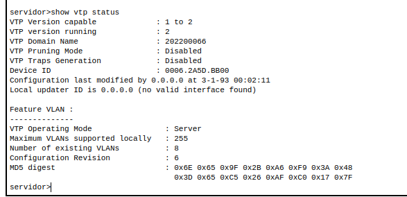
    - ### switch transparente
    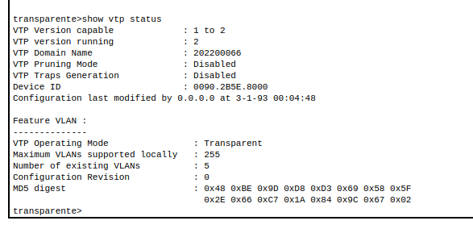
    - ### switch cliente01
    
    - ### switch cliente02
    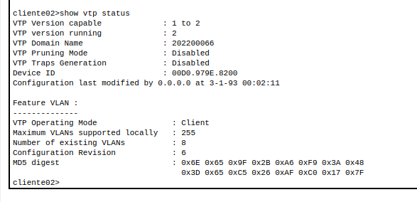

- ## Capturas VLANs
    - ### switch servidor
    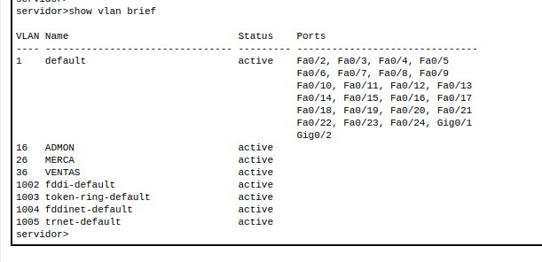
    - ### switch transparente
    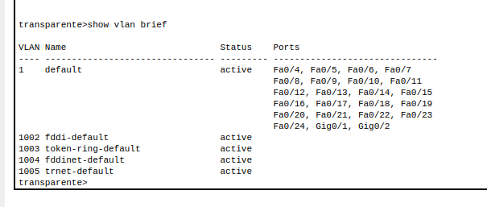
    - ### switch cliente01
    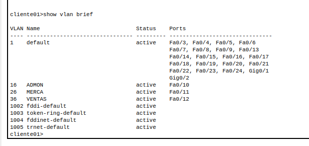
    - ### switch cliente02
    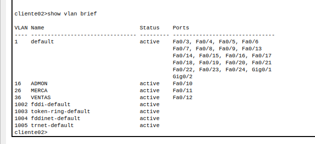

- ## Capturas ping entre VLANs
    - ### ping entre VLAN 16 y VLAN 16
     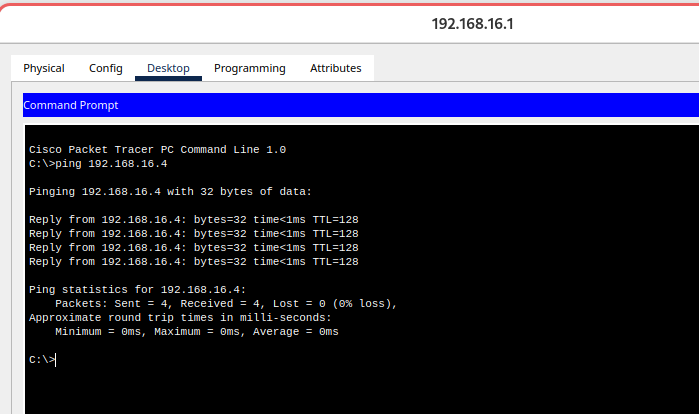
    - ### ping entre VLAN 16 y VLAN 36
     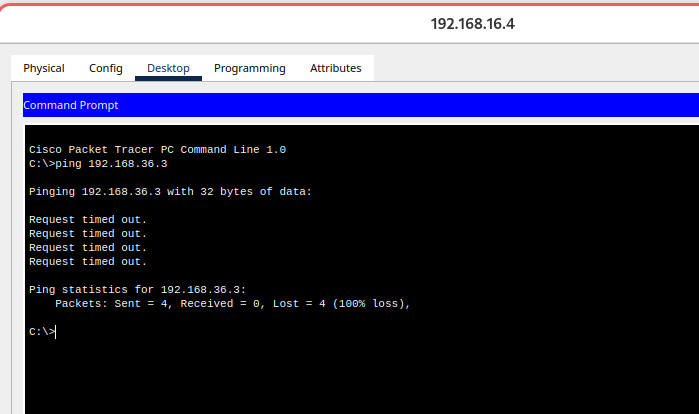
    
    - ### ping entre VLAN 26 y VLAN 26
     
    - ### ping entre VLAN 26 y VLAN 36
     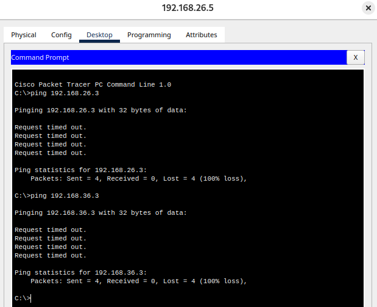
    
    - ### ping entre VLAN 36 y VLAN 36
     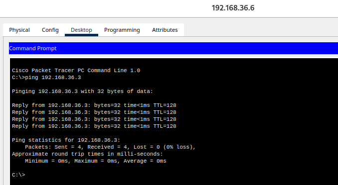
    - ### ping entre VLAN 36 y VLAN 16
     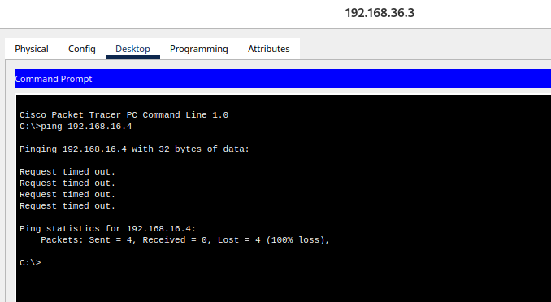

- ## Diagrama
     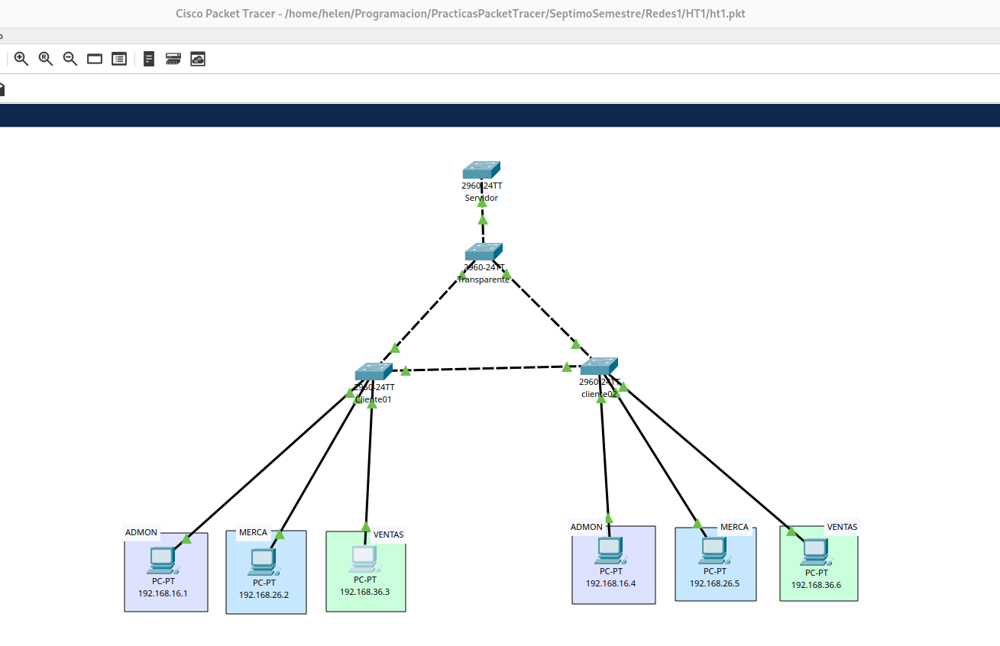