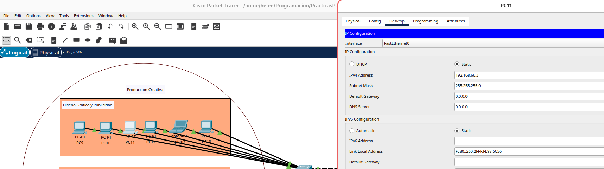
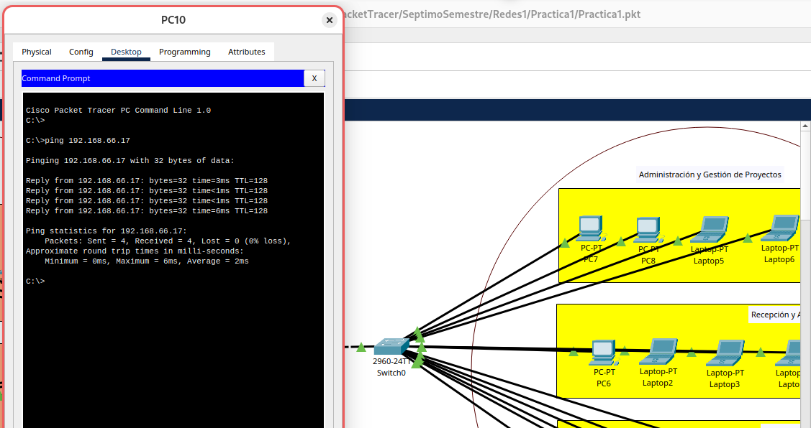
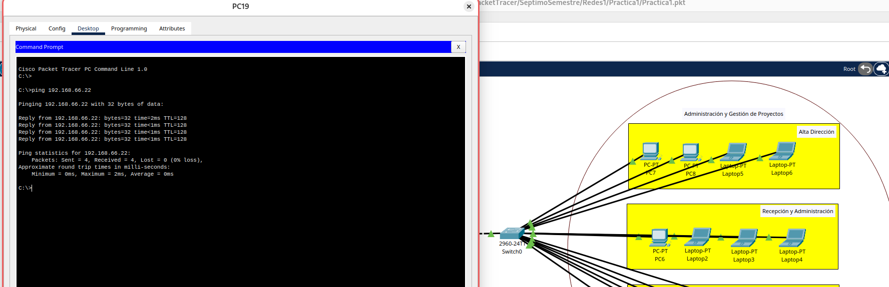
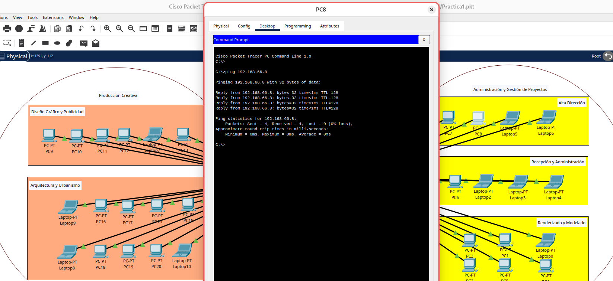
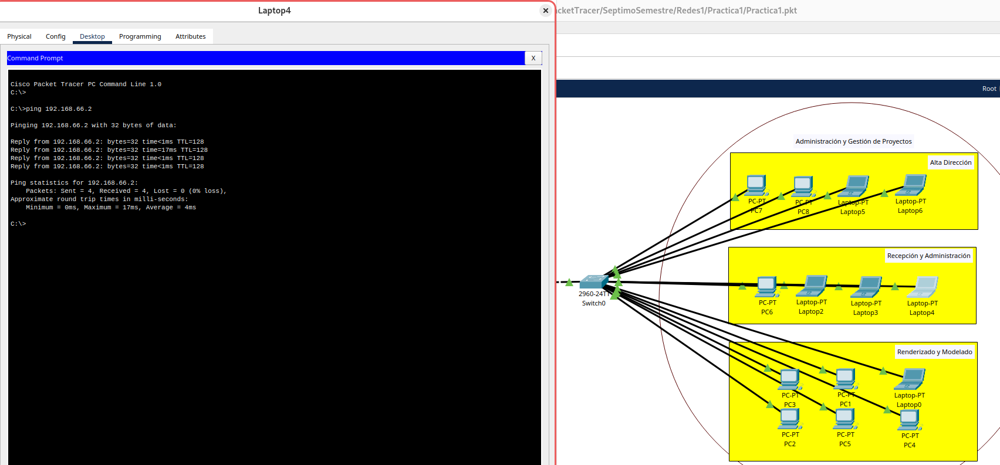

# Practica 1 Redes 1 -- Sigma Estudio

### IP utilizadas

|  **Tipo**  |     **IP**    |           **Area**          |
|:----------:|:-------------:|:---------------------------:|
| Escritorio | 192.168.66.1  | Diseño Gráfico y Publicidad |
| Escritorio | 192.168.66.2  | Diseño Gráfico y Publicidad |
| Escritorio | 192.168.66.3  | Diseño Gráfico y Publicidad |
| Escritorio | 192.168.66.4  | Diseño Gráfico y Publicidad |
| Laptop     | 192.168.66.5  | Diseño Gráfico y Publicidad |
| Escritorio | 192.168.66.6  | Diseño Gráfico y Publicidad |
| Laptop     | 192.168.66.7  | Arquitectura y Urbanismo    |
| Escritorio | 192.168.66.8  | Arquitectura y Urbanismo    |
| Escritorio | 192.168.66.9  | Arquitectura y Urbanismo    |
| Escritorio | 192.168.66.10 | Arquitectura y Urbanismo    |
| Escritorio | 192.168.66.11 | Arquitectura y Urbanismo    |
| Laptop     | 192.168.66.12 | Arquitectura y Urbanismo    |
| Escritorio | 192.168.66.13 | Arquitectura y Urbanismo    |
| Escritorio | 192.168.66.14 | Arquitectura y Urbanismo    |
| Escritorio | 192.168.66.15 | Arquitectura y Urbanismo    |
| Laptop     | 192.168.66.16 | Arquitectura y Urbanismo    |
| Escritorio | 192.168.66.17 | Alta Dirección              |
| Escritorio | 192.168.66.18 | Alta Dirección              |
| Laptop     | 192.168.66.19 | Alta Dirección              |
| Laptop     | 192.168.66.20 | Alta Dirección              |
| Escritorio | 192.168.66.21 | Recepción y Administración  |
| Laptop     | 192.168.66.22 | Recepción y Administración  |
| Laptop     | 192.168.66.23 | Recepción y Administración  |
| Laptop     | 192.168.66.24 | Recepción y Administración  |
| Escritorio | 192.168.66.25 | Renderizado y Modelado      |
| Escritorio | 192.168.66.26 | Renderizado y Modelado      |
| Laptop     | 192.168.66.27 | Renderizado y Modelado      |
| Escritorio | 192.168.66.28 | Renderizado y Modelado      |
| Escritorio | 192.168.66.29 | Renderizado y Modelado      |
| Escritorio | 192.168.66.30 | Renderizado y Modelado      |

### Comandos utilizados para switches
* enable
* configure terminal
* no ip domain-lookup
* hostname (*nombre del switch*)
* enable secret (*password nuevo*)
* write memory

### VPCs
+ VPC Diseño Gráfico y Publicidad

+ VPC Arquitectura y Urbanismo

+ VPC Alta Direccion

+ VPC Recepcion y Administracion

+ VPC Renderizado y Modelacion

### Ping entre hosts
* ping entre Diseño Gráfico y Publicidad a Recepcion y Administracion

* ping entre Arquitectura y Urbanismo a Alta Dirección

* ping entre Alta Dirección a Diseño Gráfico y Publicidad

* ping entre Recepcion y Administracion a Diseño Gráfico y Publicidad

* ping entre Renderizado y Modelado a Arquitectura y urbanismo

### Paquete ARP

### Paquete ICMP

Practica1/Imagenes/img1.png
